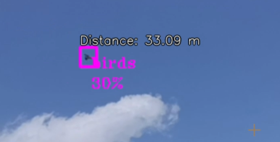

# MosquitoFinalProj
An AI solution to identify birds, drones and lasers with Oak-D Lite camera.

The project is working with our model trained in [Roboflow](https://roboflow.com) to recognize birds, drones and lasers.

You can use our model or train one of your own with Roboflow.

We used the library RoboflowOak to implement the machine.

# Examples



# Instructions

Clone this repository and open Terminal/CMD in the projects folder. Then run this command:

```
pip install -r requirements.txt
```

To run the program use:
```
python main.py
```

To use your own model, edit `main.py` and set the following variables (API key can be found in your Roboflow workspace setttings):
```
model_name = "[Roboflow-Project-Name]"
model_version = "[Trained-Model-Version]"
private_api_key = "Private-API-Key-From-Roboflow-Project-Settings"
confidence_level = The threshold confidence level from which the program should show detected object - should be a Float.

scale_factor = The preview window will be the model_resolution*scale_factor
```

